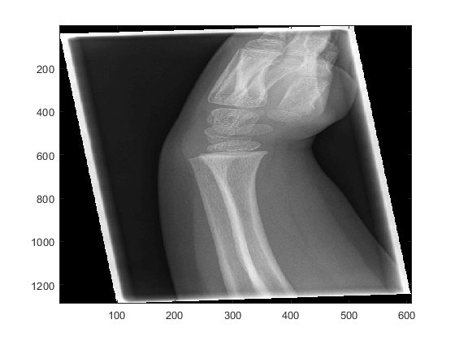
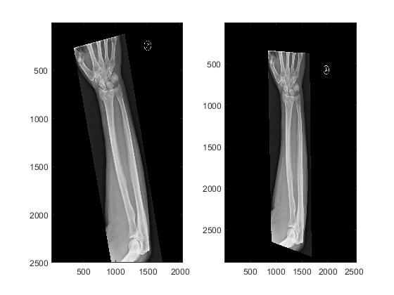
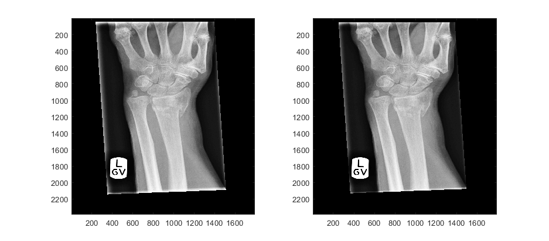
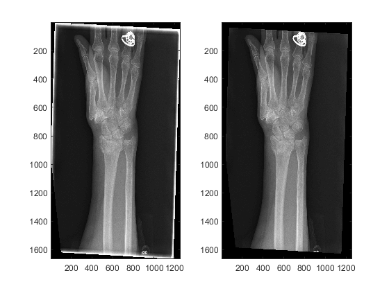
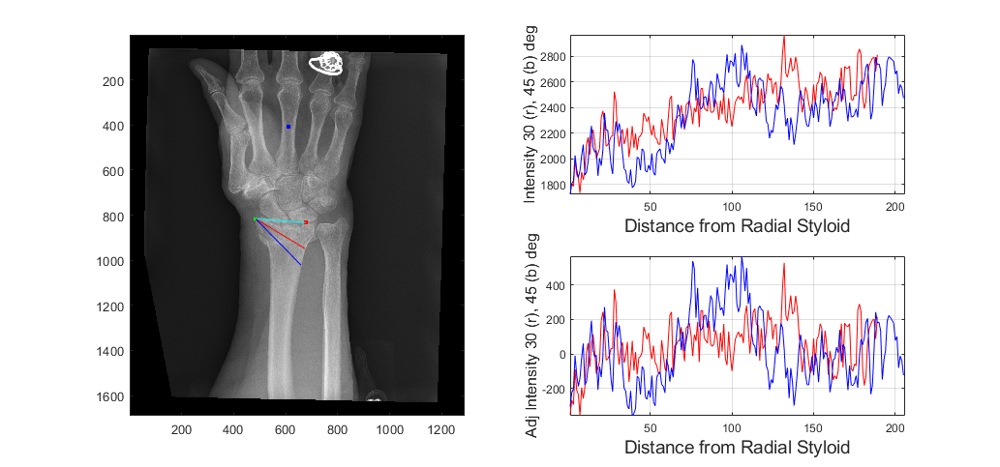
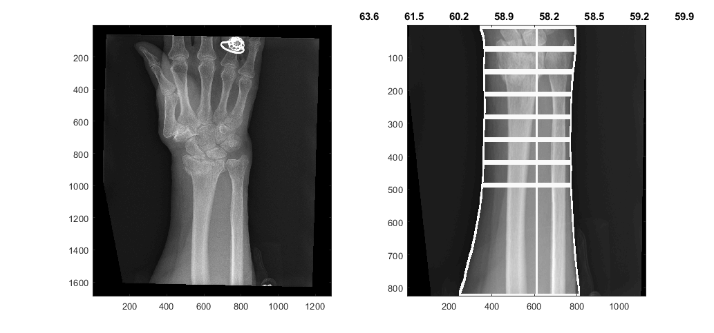
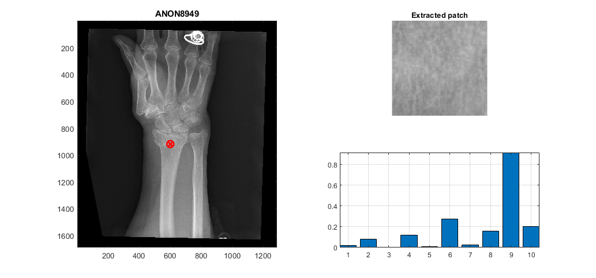
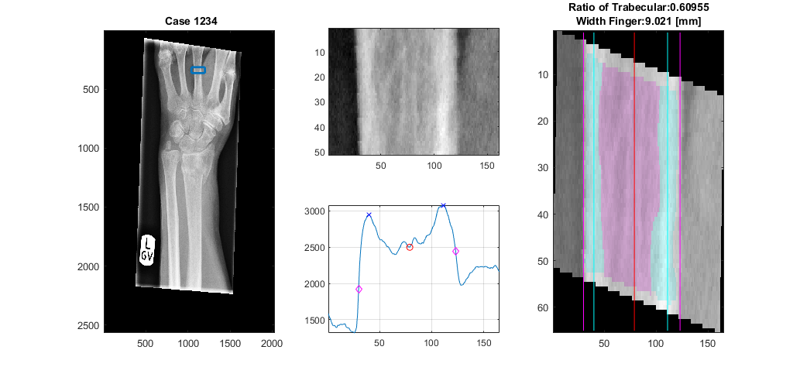

# Geometric Semi-automatic Analysis of Colles' Fractures

This repository describes a semi-automatic image processing algorithm for the geometric analysis of dorsally displaced wrist fractures (Colles’ fractures). The semi-automatic analysis require the manual location of three landmarks (finger, lunate and radial styloid) and automatic processing to generate 32 geometric and texture measurements, which may be related to conditions such as osteoporosis and swelling of the wrist.

<a name="citation"/>
<h2> Citation </h2>
</a>

This work has been published in PLOS ONE, if you find the work or the software interesting or useful, please cite as:   
<b>Reyes-Aldasoro CC, Ngan KH, Ananda A, d’Avila Garcez A, Appelboam A, Knapp KM (2020) <a href="https://journals.plos.org/plosone/article?id=10.1371/journal.pone.0238926">Geometric semi-automatic analysis of radiographs of Colles’ fractures</a>. PLoS ONE 15(9): e0238926. https://doi.org/10.1371/journal.pone.0238926  
</b>
  

A previous version of this paper was submitted to MedRXiv (https://www.medrxiv.org/content/10.1101/2020.02.18.20024562v1)
 
 

<a name="description"/>
<h2> Colles' Fractures / dorsally displaced wrist fractures </h2>
</a>

Fractures of the wrist are common in Emergency Departments, where some patients are
treated with a procedure called Manipulation under Anaesthesia. In some cases this
procedure is unsuccessful and patients need to visit the hospital again where they
undergo surgery to treat the fracture. This work describes a geometric semi-automatic
image analysis algorithm to analyse and compare the x-rays of healthy controls and
patients with dorsally displaced wrist fractures (Colles' fractures) who were treated with
Manipulation under Anaesthesia.

<a name="running"/>
<h2>Running the code</h2>
</a>

<li><a href="#1">Reading DICOM files </a></li></ul>

<li><a href="#2">Alignment of the forearm </a></li></ul>

<li><a href="#3">Remove lines of collimator </a></li></ul>

<li><a href="#4">Analysis based on the landmark of the radial styloid </a></li></ul>

<li><a href="#5">Analysis based on the landmark of the lunate </a></li></ul>

<li><a href="#6">Analysis of the texture a region of interest </a></li></ul>

<li><a href="#7">Determine the ratio of trabecular / cortical to total bone</a></li></ul>

<h2 id="1">Reading DICOM files</h2>
If your data is in DICOM format, you can read into Matlab using the functions dicomread and dicominfo like this

<pre class="codeinput">
dicom_header = dicominfo('D:\IMG0');
dicom_image = dicomread('D:\IMG0');
</pre>
<pre class="codeinput">dicom_header
</pre><pre class="codeoutput">
dicom_header =

struct with fields:

                                Filename: 'D:\IMG0'
                             FileModDate: '27-Jun-2017 11:19:50'
                                FileSize: 1567164
                                  Format: 'DICOM'
                           FormatVersion: 3
                                   Width: 608
                                  Height: 1287
                                BitDepth: 12
                               ColorType: 'grayscale'
                               .
                               .
                               .
               PhotometricInterpretation: 'MONOCHROME2'
                                    Rows: 1287
                                 Columns: 608

</pre>

<pre class="codeinput">imagesc(dicom_image)
colormap gray
</pre>

If you are going to handle numerous images, it can be convenient to read the dicom and then save in Matlab format as a .mat  file. You can save the header and the image into a single file. In subsequent files, the image will be identified with the name <b>"Xray"</b> and the header with the name <b>"Xray_info"</b>. Later on you can also add the mask (the three landmarks) as <b>"Xray_mask"</b>. Then these can be loaded together from one file, e.g.
<pre class="codeinput">clear
load('D:\PATIENT_PA.mat')

whos
</pre><pre class="codeoutput">  Name              Size                 Bytes  Class     Attributes
Xray           2500x2048            40960000  double              
Xray_info         1x1                  16820  struct              
Xray_mask      2500x2048            40960000  double              
</pre>
<h2 id="2">Alignment of the forearm</h2>
To rotate the Xray so that the forearm is aligned vertically, use the function alingXray. If you are already using a mask, the mask should also be b provided so that it is rotated with the same angle. The actual angle of rotation is one output parameter.
<pre class="codeinput">[XrayR,Xray_maskR,angleRot]     = alignXray (Xray,Xray_mask);

disp(angleRot)

figure(1)
subplot(121)
imagesc(Xray)
subplot(122)
imagesc(XrayR)
</pre><pre class="codeoutput">   -13

</pre>
<h2 id="3">Remove lines of collimator</h2>
In case the image has lines due to the collimator and these should be removed, use the function removeEdgesCollimator. The function receives the Xray as input, and if desired a second parameter that controls the width of the removal, if the default value (set at 25) does not work, try increasing it.
<pre class="codeinput">load('D:\OneDrive - City, University of London\Acad\Research\Exeter_Fracture\DICOM_Karen\ANON8949_PATIENT_PA_594.mat')

XrayR2                          = removeEdgesCollimator2(Xray);
figure(1)
subplot(121)
imagesc(Xray)
subplot(122)
imagesc(XrayR2)

XrayR2                          = removeEdgesCollimator2(Xray,70);
figure(2)
subplot(121)
imagesc(Xray)
subplot(122)
imagesc(XrayR2)
colormap gray
</pre> 

Notice that we are concatenating results: Xray -&gt; XrayR -&gt; XrayR2.

<h2 id="4">Analysis based on the landmark of the radial styloid</h2>

To determine two profiles from the radial styloid to the edge of the radius at 30 and 45 degrees below the line between the radial styloid and the lunate the function analyseLandmarkRadial is used in the following way:

<pre class="codeinput">displayData                     = 1;

[stats,displayResultsRadial]    = analyseLandmarkRadial (XrayR2,Xray_maskR,Xray_info,'Case 1234',displayData);

</pre>
 
Notice that we have used the variable "displayData", which if set to 1, prompts the data to be displayed in a new figure. If it is set to 0 (or not passed as an input variable) no new figure is generated. In addition, the name of the case ('Case 1234') has been passed as an input.

The output variable 'stats' contain values about the lines (slope, standard deviation, etc)

<pre class="codeinput">stats
</pre><pre class="codeoutput">
stats =

  struct with fields:

          slope_1: 1.9149
          slope_2: 1.5220
    slope_short_1: 6.6215
    slope_short_2: 3.8167
            std_1: 243.0131
            std_2: 252.0656
         std_ad_1: 153.6793
         std_ad_2: 131.0886
          row_LBP: 1189
          col_LBP: 1060

</pre>

In addition displayResultsRadial contains the actual profiles of the lines, as well as the data with the profiles and the landmarks.

<pre class="codeinput">displayResultsRadial
</pre><pre class="codeoutput">
displayResultsRadial =

  struct with fields:

     prof_radial_new1: [329&times;1 double]
     prof_radial_new2: [521&times;1 double]
    prof2_radial_new1: [329&times;1 double]
    prof2_radial_new2: [521&times;1 double]
           dataOutput: [2567&times;2033&times;3 double]
          dist_prof_1: 44.6530
          dist_prof_2: 58.4762

</pre>

 <h2 id="5">Analysis based on the landmark of the lunate</h2>
 
The landmark of the lunate is used to determine the forearm, and from there delineate the edges of the arm, and trace 8 lines that measure the width of the forearm, each at one cm of separation. The widths are displayed on the figure when you select to display.

 <pre class="codeinput">[edgesArm,widthAtCM,displayResultsLunate,dataOutput,coordinatesArm]    = analyseLandmarkLunate (XrayR2,Xray_maskR,Xray_info,'Case 1234',displayData);
 </pre>

</pre>

Of the previous output variables, edgesArm is a 2D matrix with the delineation of the arm, displayResultsLunate is a 2D matrix with the lines overlaid on the original Xray, dataOutput is the same, except that the lines are in red for better contrast. widthAtCM are the actual width of each line. coordinatesArm are the rows and columns that are used to crop the forearm.

<h2 id="6">Analysis of the texture a region of interest</h2>
A region of interest is detected and the Local Binary Pattern is calculated, the location of the region is selected as an intermediate point of the previously located profiles, so these are necessary input parameters.

<pre class="codeinput">sizeInMM                        = [5, 5];
[LBP_Features,displayResultsLBP]    = ComputeLBPInPatch(XrayR2,Xray_info,Xray_maskR,stats.row_LBP,stats.col_LBP+50,sizeInMM,displayData);
</pre>

<h2 id="7">Determine the ratio of trabecular / cortical to total bone</h2>
The analysis of the landmark of the central finger segments the bone according to the trabecular and cortical regions and then calculates the ratio.
<pre class="codeinput">

[TrabecularToTotal,WidthFinger,displayResultsFinger] = analyseLandmarkFinger (XrayR,Xray_maskR,Xray_info,'Case 1234',displayData);

</pre>

 <a href="https://www.mathworks.com/products/matlab/">Published with MATLAB&reg; R2019a</a> 

